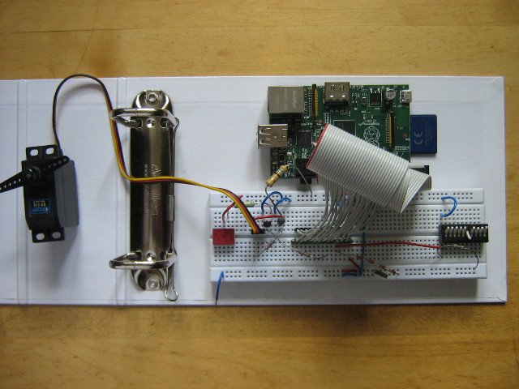

Bread Board Berry
=================
A quick experiment to combine a Raspberry Pi running Raspbian GNU Linux, a breadboard and some attic electronic parts. Mix that with Nodejs, Expressjs, jQuery, stur well and *Voila* there is your breadboard web interface ;-) .

Most time consuming was collecting together all the hardware on a cloudy public holiday, a few hours later, the LED was flashing and the DIL switch showed up as "on/off" on the browser.

Hardware
--------
Let the hacking begin, warm up soldering irons ...


Architecture
------------
As part of this experiment I used <http://coffeescript.org/> to see how well it works for rapid development. The software part consists of `htp.coffee` which is the server backend and `ac.coffee` which is the client frontend. They periodically communicate via AJAX to update screen and hardware.

The software follows a single-page-app-like approach using object-oriented code on the frontend. This may not be efficient in general but comes in handy when customizing the web interface for specific breadboard hardware fixtures later on.

On the Pi, GPIO access requires you to enter/setup root credentials.

Two Modes of Operation
----------------------
The server is able to run on hardware without the Pi's GPIO. In this case no root access is required. This may speed up development.

Prerequisite
-----------
Compile <http://nodejs.org/> on the Pi / cross-compile it on your desktop. Make sure that `init.sh` sets the `PATH` to your nodejs installation's `bin`. I used nodejs/0.8.21 .

Initialization
--------------
Open a shell and issue:
```
cd breadboardberry
. init.sh
```

Clean Up
--------
`make clean`

Compile
-------
`make`

Extra step on Raspberry Pi
--------------------------
As `rpio` and `gpio` npm modules do only compile on the Pi, they are not part of the `package.json` file. As such you need to manually install/update them as needed.

Once:
`npm install rpio gpio`

For an update:
`npm update rpio gpio`

Run
---
Make sure the run target in `Makefile` uses `sudo` when on Raspberry Pi, then
`make run`

To stop, type Ctrl-c .

Flaws / ToDo
------------
Clearly this is no realtime solution. Neither the polling style refresh of the GPIO reading nor the fact that there is no realtime kernel used mean that updates are limited to a few times per second max. Also be prepared that any CPU interrupts harm any timing you might hope to see.

Going away from the standard Raspbian towards an ARMv6 realtime kernel (or at least using kernel drivers which can follow scheduled events) or use some Arduino style hardware inbetween would solve the hardware part. The polling could be replaced by websockets / socket.io .

Another flaw is the root access need of the server to gain legitimation to access GPIO hardware. Here a kernel driver would be way more elegant and safe. For lab conditions this may not be harmful, but never expose the server to unknown networks!

Tests? Ah, right. Yep - there should be some ;-)

Copyright
---------
Copyright (C) 2013 Jörg Engelhart


License
-------
GNU General Public License, version 2

